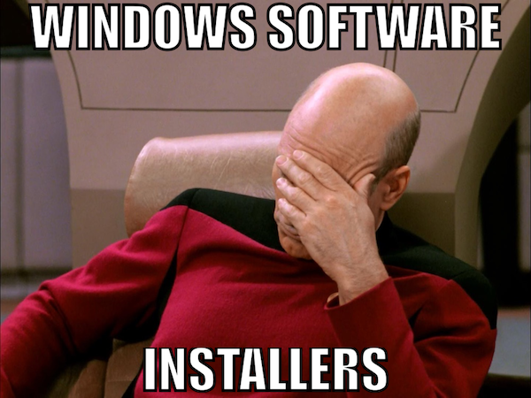
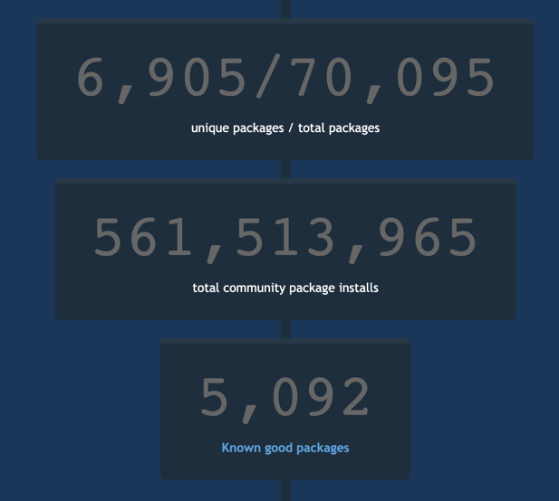

@title[Simplify Windows Software Packaging and Automation with Chocolatey]

## Simplify Windows Software Packaging and Automation with Chocolatey

---?color=#7FDBFF
@title[Slides and Code]

## Slides

### https://gep13.me/ChocoChefSlides

## Code

### https://gep13.me/ChocoChefCode

---?image=assets/img/bg/black.jpg&position=left&size=35% 100%
@title[What is Chocolatey?]

@snap[west h4-white]

#### Question

@snapend

@snap[east span-80]

#### What is
## @css[text-gold text-bold](Chocolatey )@fa[question]

@snapend

+++?image=assets/img/bg/blue.jpg&position=left&size=35% 100%
@title[Immutable Infrastructure]

@snap[west h4-white]

#### Answer

@snapend

@snap[east span-70]
@quote[Chocolatey allows you to deploy any Windows software, anywhere, with anything, and manage and track that software over time.](Rob Reynolds - Creator of Chocolatey)"
@snapend

+++

Chocolatey is a package manager for Windows

+++

Similar to apt-get, yum, and Homebrew

+++

### With Chocolatey you can...

* Manage ANY software, not just installers
* Define dependencies
* Write a software deployment one time (with PowerShell)
* Test your deployment before deploying to Production
* Deploy to any supported version of Windows (including Server.Core and Docker Containers)
* Track and Report on software

+++

@title[It's Magic!]


---?image=assets/img/bg/black.jpg&position=left&size=35% 100%
@title[What problem is Chocolatey trying to solve?]

@snap[west h4-white]

#### Question

@snapend

@snap[east span-80]

#### What problem is Chocolatey
## @css[text-gold text-bold](trying to solve )@fa[question]

@snapend

+++?image=assets/img/bg/blue.jpg&position=left&size=35% 100%
@title[Windows Software Ecosystem]

@snap[west h4-white]

#### Answer

@snapend

@snap[east span-70]
Windows Software Ecosystem
@snapend

+++

@title[Traditional Windows]

### Traditionally Windows was designed with visual interfaces in mind

+++

@title[Still evident]

### There is no place more evident of that still than in the Windows software installer ecosystem

+++

@title[Windows Software Installers]



+++

@title[No Consistency]

### No Consistency

- Over 20 installer formats and thousands of installers in the wild
- Zips and other archive formats
- Software installers are messy
- It's like the wild west

+++

@title[Wild West]


---?image=assets/img/bg/black.jpg&position=left&size=35% 100%
@title[How does it work?]

@snap[west h4-white]

#### Question

@snapend

@snap[east span-80]

#### How does it
## @css[text-gold text-bold](work )@fa[question]

@snapend

+++?image=assets/img/bg/blue.jpg&position=left&size=35% 100%
@title[A series of simple commands]

@snap[west h4-white]

#### Answer

@snapend

@snap[east span-70]
A series of simple commands
@snapend

+++

```powershell
choco install paint.net
```

```powershell
choco upgrade paint.net
```

```powershell
choco uninstall paint.net
```

```powershell
choco upgrade all
```

+++
@title[Community Repository]

### Community Repository



+++
@title[What is the catch?]

### What is the catch?

+++
@title[Organisational Use]

### Organisational Use


+++
@title[Chocolatey Architecture Diagram]


---?image=assets/img/bg/black.jpg&position=left&size=35% 100%
@title[What do I get when I pay for Chocolatey?]

@snap[west h4-white]

#### Question

@snapend

@snap[east span-80]

#### What do I get when I pay for
## @css[text-gold text-bold](Chocolatey )@fa[question]

@snapend

+++
@title[Commercial Capabilities]

### Commercial Capabilities


+++
@title[Chocolatey Central Management]

### Chocolatey Central Management


---?image=assets/img/bg/black.jpg&position=left&size=35% 100%
@title[What does Chocolatey integrate with?]

@snap[west h4-white]

#### Question

@snapend

@snap[east span-80]

#### What does Chocolatey
## @css[text-gold text-bold](integrate with )@fa[question]

@snapend

+++?image=assets/img/bg/blue.jpg&position=left&size=35% 100%
@title[Chocolatey Integrations]

@snap[west h4-white]

#### Answer

@snapend

@snap[east span-70]
Everything
@emoji[heart_eyes]
@snapend

+++

@title[Sane Software Management]


The @css[text-gold text-bold](Sane) Way to Manage Software on Windows

---?image=assets/img/bg/black.jpg&position=left&size=35% 100%
@title[How does Chef integrate with Chocolatey?]

@snap[west h4-white]

#### Question

@snapend

@snap[east span-80]

#### How does Chef integrate
## @css[text-gold text-bold](with Chocolatey )@fa[question]

@snapend

+++?image=assets/img/bg/blue.jpg&position=left&size=35% 100%
@title[Cookbooks and Resources]

@snap[west h4-white]

#### Answer

@snapend

@snap[east span-70]
Cookbooks and Resources
@snapend

+++

@title[Chocolatey Cookbook]

### Chocolatey Cookbook


+++?code=assets/files/chocolatey_package.rb&title=Resource: chocolatey_package
@title[chocolatey_package.rb]

##### Available in Chef Client 12.7+

+++?code=assets/files/chocolatey_source.rb&title=Resource: chocolatey_source
@title[chocolatey_source.rb]

##### Available in Chef Client 14.3+

+++?code=assets/files/chocolatey_config.rb&title=Resource: chocolatey_config
@title[chocolatey_config.rb]

##### Available in Chef Client 14.3+

+++?code=assets/files/chocolatey_feature.rb&title=Resource: chocolatey_feature
@title[chocolatey_feature.rb]

##### Available in Chef Client 15.1+


---?code=chef/cookbooks/install-git/recipes/default.rb&title=chocolatey_package installing git
@title[default.rb]

@[1](Include default recipe from chocolatey cookbook)
@[3-6](Use chocolatey_package)

+++

DON'T DO THIS! @emoji[smile]

+++

### Attributes


This will avoid rate limiting when using Chocolatey Community Repository

+++?color=beige
@title[Demo - chocolatey_package]

## Demo

### Use chocolatey_package to install git

---?code=chef/cookbooks/uninstall-git/recipes/default.rb&title=chocolatey_package uninstalling git
@title[default.rb]

@[1](Include default recipe from chocolatey cookbook)
@[3-5](Use chocolatey_package)

+++?color=beige
@title[Demo - chocolatey_package]

## Demo

### Use chocolatey_package to uninstall git

---?code=chef/cookbooks/chocolatey-server/recipes/default.rb&title=Install and configure chocolatey.server
@title[default.rb]

@[19](Include default recipe from chocolatey cookbook)
@[36-39](Create new directory)
@[41-43](Install chocolatey.server package)
@[49-52](Set Chocolatey Configuration)
@[68-73](Install Windows Features)
@[151-158](Configure Chocolatey Sources)

+++o?color=beige
@title[Demo - Install and configure chocolatey.server]

## Demo

### Install and configure chocolatey.server

+++

### Other repository servers are available

* Artifactory
* Sonatype Nexus
* ProGet

---?color=#7FDBFF
@title[Who Am I? - Gary Ewan Park]

@snap[north-west]
Who am I?
@snapend

@snap[west span-65]
Senior Software Engineer @ Chocolatey Software
<br>
<br>


@snapend

@snap[east span-30]

<br>

Gary Ewan Park

@snapend

@snap[south-west bio-contact]
@fa[twitter twitter-blue]&nbsp;&nbsp;gep13&nbsp;&nbsp;&nbsp;&nbsp;&nbsp;
@fa[github text-black]&nbsp;&nbsp;github.com/gep13&nbsp;&nbsp;&nbsp;&nbsp;&nbsp;
@fa[home text-blue]&nbsp;&nbsp;gep13.co.uk&nbsp;&nbsp;&nbsp;&nbsp;&nbsp;
@fa[envelope choco-blue]&nbsp;&nbsp;gary@chocolatey.io
@snapend

+++

@title[Questions]

## Questions

Feel free to get in touch

Email: gary@chocolatey.io

Twitter: @gep13

Web: https://www.gep13.co.uk

---

@title[Learn More]

## Learn More

* Sales - [https://chocolatey.org/contact](https://chocolatey.org/contact) (choose Sales)
* Chocolatey Documentation - [https://chocolatey.org/docs](https://chocolatey.org/docs)
* Source Code - [https://github.com/chocolatey/choco](https://github.com/chocolatey/choco)
* Learning Resources - [https://chocolatey.org/docs/resources](https://chocolatey.org/docs/resources)
