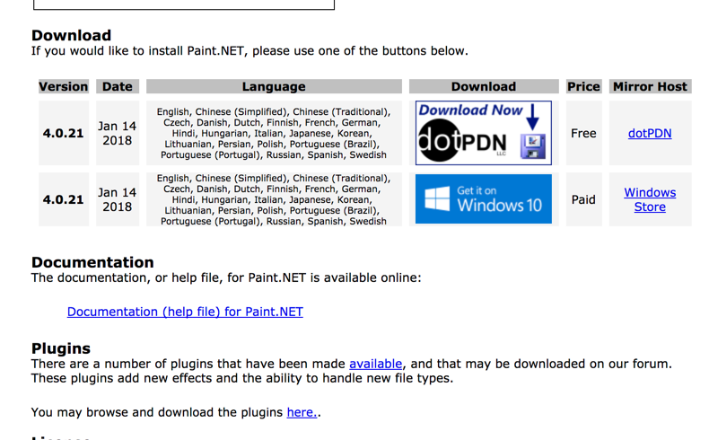
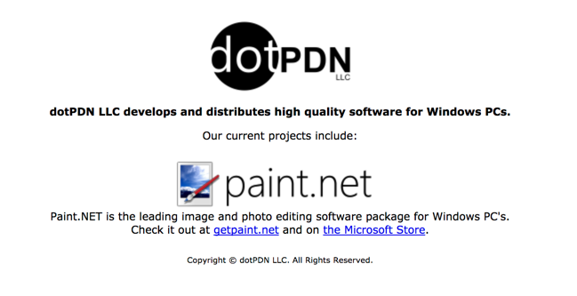
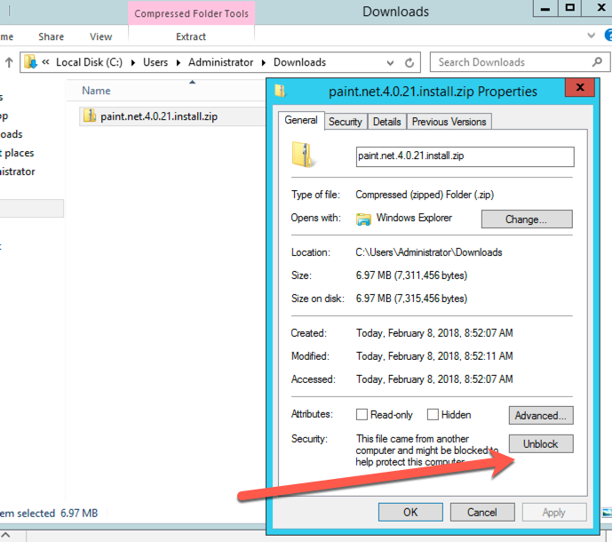
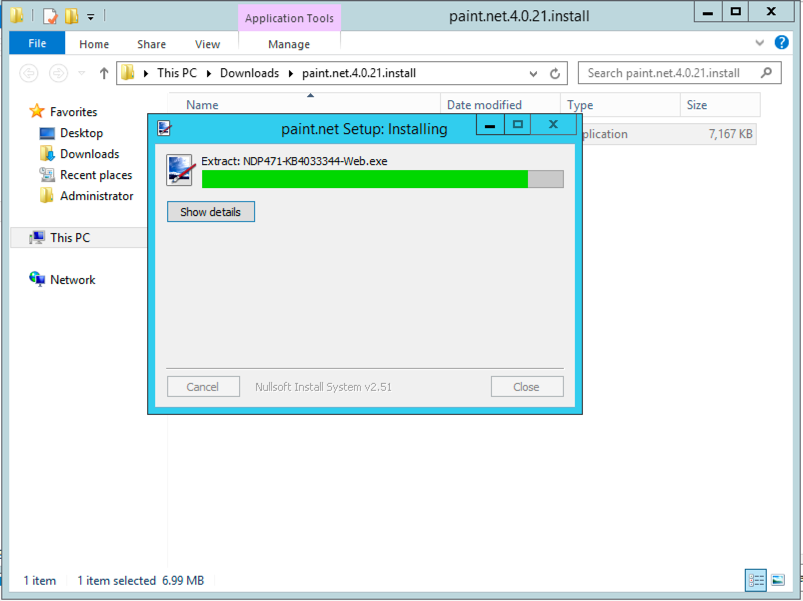
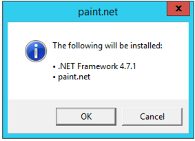

@title[Simplify Windows Software Packaging and Automation with Chocolatey]

@snap[midpoint h3-blue span-100]
# Chocolatey
### Simplifying Windows Software Packaging and Automation
@snapend

---

@title[Slides and Code]

## Slides

#### https://gep13.me/ChocoChefSlides

@fa[plus-square fa-2x fa-pad-icon text-gold]

## Code

#### https://gep13.me/ChocoChefCode

---?color=linear-gradient(90deg, black 25%, white 25%)

@title[What is Chocolatey?]

@snap[west h1-white]
# Q
@snapend

@snap[east span-65]

#### What is
## @css[text-gold text-bold](Chocolatey )@fa[question]

@snapend

---?color=linear-gradient(90deg, #5289F7 25%, white 25%)
@title[Chocolatey]

@snap[north-east text-05 text-gray]
Q. What is Chocolately?
@snapend

@snap[west h1-white]
# A
@snapend

@snap[east span-70]
@quote[Chocolatey allows you to deploy any Windows software, anywhere, with anything, and manage and track that software over time.](Rob Reynolds - Creator of Chocolatey)"
@snapend

+++

#### Chocolatey is a package manager for Windows

+++

#### Similar to apt-get, yum, and Homebrew

+++

### With Chocolatey you can...

* Manage ANY software, not just installers
* Define dependencies
* Write a software deployment one time (with PowerShell)
* Test your deployment before deploying to Production
* Deploy to any supported version of Windows (including Server.Core and Docker Containers)
* Track and Report on software

+++?image=assets/img/magic.gif&size=45% auto&color=#A74433

@title[It's Magic!]

---?color=linear-gradient(90deg, black 25%, white 25%)
@title[What problem is Chocolatey trying to solve?]

@snap[west h1-white]
# Q
@snapend

@snap[east span-80 text-right]

#### What problem is Chocolatey
## @css[text-gold text-bold](trying to solve )@fa[question]

@snapend

---?color=linear-gradient(90deg, #5289F7 25%, white 25%)
@title[Windows Software Ecosystem]

@snap[north-east text-05 text-gray]
Q. What problem is Chocolately trying to solve?
@snapend

@snap[west h1-white]

# A

@snapend

@snap[east span-70]
## Windows Software Ecosystem
@snapend

+++

@title[Traditional Windows]

### Traditionally Windows was designed with visual interfaces in mind

+++

@title[Still evident]

### There is no place more evident of that still than in the Windows software installer ecosystem

+++?color=#8B1E26

@title[Windows Software Installers]

+++

@title[No Consistency]

### No Consistency

- Over 20 installer formats and thousands of installers in the wild
- Zips and other archive formats
- Software installers are messy
- It's like the wild west

+++?color=#261F1D

@title[Wild West]

---?color=linear-gradient(90deg, black 25%, white 25%)
@title[How does it work?]

@snap[west h1-white]

# Q

@snapend

@snap[east span-80]

#### How does Chocolatey
# @css[text-gold text-bold](work )@fa[question]

@snapend

+++

@title[Let's install paint.net]

## Let's install paint.net...

+++

@title[paint.net website]

<!-- .slide: data-transition="none" -->

+++

@title[Not the paint.net website]

<!-- .slide: data-transition="none" -->

+++

@title[Google paint.net]

<!-- .slide: data-transition="none" -->

+++

@title[Actual paint.net website]

<!-- .slide: data-transition="none" -->

+++

@title[paint.net download]

<!-- .slide: data-transition="none" -->

+++

@title[Mirror website]

<!-- .slide: data-transition="none" -->

+++

@title[Actual paint.net download]

<!-- .slide: data-transition="none" -->

+++

@title[Unblock zip file]

<!-- .slide: data-transition="none" -->

+++

@title[Extract zip file]

<!-- .slide: data-transition="none" -->

+++

@title[Install paint.net]

<!-- .slide: data-transition="none" -->

+++

@title[paint.net dependencies]

<!-- .slide: data-transition="none" -->

+++

@title[There has to be a better way!]

## @fa[quote-left] There has to be a better way!

+++

@title[Chocolatey]

---?color=linear-gradient(90deg, #5289F7 25%, white 25%)
@title[A series of simple commands]

@snap[north-east text-05 text-gray]
Q. How does Chocolately work?
@snapend

@snap[west h1-white]

# A

@snapend

@snap[east span-70]
## A series of simple commands
@snapend

+++

@code[powershell zoom-25](assets/files/cmds.ps1)

+++
@title[Community Repository]

### Community Repository

+++
@title[What is the catch?]

### What is the catch?

+++
@title[Organisational Use]

### Organisational Use

+++
@title[Chocolatey Architecture Diagram]

---?color=linear-gradient(90deg, black 25%, white 25%)
@title[What do I get when I pay for Chocolatey?]

@snap[west h1-white]

# Q

@snapend

@snap[east span-80]

#### What do I get when I pay for
## @css[text-gold text-bold](Chocolatey )@fa[question]

@snapend

+++
@title[Commercial Capabilities]

### Commercial Capabilities

+++
@title[Chocolatey Central Management]

### Chocolatey Central Management

---?color=linear-gradient(90deg, black 25%, white 25%)
@title[What does Chocolatey integrate with?]

@snap[west h1-white]

# Q

@snapend

@snap[east span-80]

#### What does Chocolatey
## @css[text-gold text-bold](integrate with )@fa[question]

@snapend

---?color=linear-gradient(90deg, #5289F7 25%, white 25%)
@title[Chocolatey Integrations]

@snap[north-east text-05 text-gray]
Q. What does Chocolately integrate with?
@snapend

@snap[west h1-white]

# A

@snapend

@snap[east span-70]
## Everything @fa[heart text-blue]
@snapend

+++

@title[Sane Software Management]

The @css[text-gold text-bold](Sane) Way to Manage Software on Windows

---?color=linear-gradient(90deg, black 25%, white 25%)
@title[How does Chef integrate with Chocolatey?]

@snap[west h1-white]

# Q

@snapend

@snap[east span-80]

#### How does Chef integrate with
## @css[text-gold text-bold](Chocolatey )@fa[question]

@snapend

---?color=linear-gradient(90deg, #5289F7 25%, white 25%)
@title[Cookbooks and Resources]

@snap[north-east text-05 text-gray]
Q. How does Chef integrate with Chocolately?
@snapend

@snap[west h1-white]

# A

@snapend

@snap[east span-70]
## Cookbooks and Resources
@snapend

+++

@title[Chocolatey Cookbook]

### Chocolatey Cookbook

+++
@title[chocolatey_package.rb]

@snap[north span-100]
#### Resource: chocolatey_package
@snapend

@code[ruby](assets/files/chocolatey_package.rb)

@snap[south span-100]
#### Available in Chef Client 12.7+
@snapend

+++
@title[chocolatey_source.rb]

@snap[north span-100]
#### Resource: chocolatey_source
@snapend

@code[ruby zoom-11](assets/files/chocolatey_source.rb)

@snap[south span-100]
##### Available in Chef Client 14.3+
@snapend

+++
@title[chocolatey_config.rb]

@snap[north span-100]
#### Resource: chocolatey_config
@snapend

@code[ruby zoom-11](assets/files/chocolatey_config.rb)

@snap[south span-100]
#### Available in Chef Client 14.3+
@snapend

+++
@title[chocolatey_feature.rb]

@snap[north span-100]
#### Resource: chocolatey_feature
@snapend

@code[ruby](assets/files/chocolatey_feature.rb)

@snap[south span-100]
#### Available in Chef Client 15.1+
@snapend

---
@title[default.rb]
@snap[north span-100]
chocolatey_package installing git
@snapend

@code[ruby, zoom-19](chef/cookbooks/install-git/recipes/default.rb)

@snap[south span-100]
@[1](Include default recipe from chocolatey cookbook)
@[3-6](Use chocolatey_package)
@snapend

+++

## DON'T DO THIS! @emoji[smile]

+++

@snap[north span-100]
### Attributes
@snapend

@snap[south span-100 text-07]
This will avoid rate limiting when using Chocolatey Community Repository
@snapend

+++?color=beige
@title[Demo - chocolatey_package]

# Demo

#### Use chocolatey_package to install git

---
@title[default.rb]
@snap[north span-100]
chocolatey_package uninstalling git
@snapend

@code[ruby zoom-19](chef/cookbooks/uninstall-git/recipes/default.rb)

@snap[south span-100]
@[1](Include default recipe from chocolatey cookbook)
@[3-5](Use chocolatey_package)
@snapend

+++?color=beige
@title[Demo - chocolatey_package]

# Demo

#### Use chocolatey_package to uninstall git

---?code=chef/cookbooks/chocolatey-server/recipes/default.rb&title=Install and configure chocolatey.server
@title[default.rb]

@[19, zoom-20](Include default recipe from chocolatey cookbook)
@[36-39, zoom-12](Create new directory)
@[41-43, zoom-16](Install chocolatey.server package)
@[49-52, zoom-18](Set Chocolatey Configuration)
@[68-73](Install Windows Features)
@[151-158, zoom-12](Configure Chocolatey Sources)

+++o?color=beige
@title[Demo - Install and configure chocolatey.server]

# Demo

#### Install and configure chocolatey.server

+++

@snap[north span-100]
#### Other repository servers are available...
@snapend

* ### Artifactory
* ### Sonatype Nexus
* ### ProGet

---?color=#7FDBFF
@title[Who Am I? - Gary Ewan Park]

@snap[north-west]
#### Who am I?
@snapend

@snap[west span-65]
Senior Software Engineer @ Chocolatey Software
 
 

@snapend

@snap[east span-30]

 

Gary Ewan Park

@snapend

@snap[south-west bio-contact span-100]
@fa[twitter twitter-blue]&nbsp;&nbsp;gep13&nbsp;&nbsp;&nbsp;&nbsp;&nbsp;
@fa[github text-black]&nbsp;&nbsp;github.com/gep13&nbsp;&nbsp;&nbsp;&nbsp;&nbsp;
@fa[home text-blue]&nbsp;&nbsp;gep13.co.uk&nbsp;&nbsp;&nbsp;&nbsp;&nbsp;
@fa[envelope choco-blue]&nbsp;&nbsp;gary@chocolatey.io
@snapend

+++

@title[Questions]

## Questions

Feel free to get in touch

Email: gary@chocolatey.io

Twitter: @gep13

Web: https://www.gep13.co.uk

---

@title[Learn More]

## Learn More

@ul[text-08](false)
* Sales - [https://chocolatey.org/contact](https://chocolatey.org/contact) (choose Sales)
* Chocolatey Documentation - [https://chocolatey.org/docs](https://chocolatey.org/docs)
* Source Code - [https://github.com/chocolatey/choco](https://github.com/chocolatey/choco)
* Learning Resources - [https://chocolatey.org/docs/resources](https://chocolatey.org/docs/resources)
@ulend
